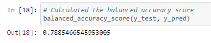

# Credit_Risk_Analysis

## Overview of the loan prediction risk analysis:

We used multiple oversampling, undersampling and combination analysises to see if individuals truly pose a risk when given loans. We want to be sure to give customers the loans they deserve if they do not pose a risk.

## Results:
### - Naive Random Oversampling

This yielded about 65% accuracy. Both recall scores are low for both high and low risks (66% and 62% respectively). The precision score is low for high risk (1%) and high for low risk (100%).

### - SMOTE Oversampling

This yielded about 66% accuracy. Both recall scores are low for both high and low risks (61% and 69% respectively). The precision score is low for high risk (1%) and high for low risk (100%).

### - Cluster Centroids Undersampling

This yielded about 55% accuracy. Both recall scores are low for both high and low risks (68% and 10% respectively). The precision score is low for high risk (1%) and high for low risk (100%).

### - SMOTEENN Sampling

This yielded about 65% accuracy. The recall score for high risk was a moderate 71% while the recall score for low risk was only 57%. The precision score is low for high risk (1%) and high for low risk (100%).

### - Balanced Random Forest Classifier

This yielded about 79% accuracy. The recall score for high risk was a moderate 70% while the recall score for low risk was high with 87%. The precision score is low for high risk (3%) and high for low risk (100%).

### - Easy Ensemble Classifier

This yielded about 93% accuracy. Both recall scores are high for both high and low risks (92% and 94% respectively). The precision score is low for high risk (9%) and high for low risk (100%).

## Summary:

Overall, after checking the accuracy, precision, and recall of 6 different models, only 1 really stood out as possibly giving good results. The Easy Ensemble Classifer was able to give both a high balanced accuracy score and high scores for the recall on both high and low risk profiles.

The only drawback was the precision score for the high risk was low. This was true for all 6 models however. Since all 6 models failed on the precision scores, it is diifficult to determine if even the Easy Ensemble Classifier model should be recommended.
